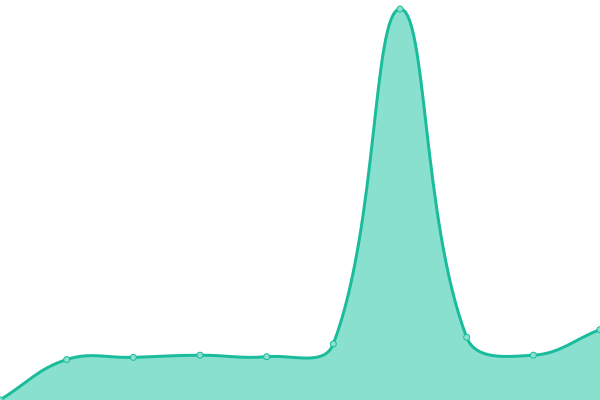
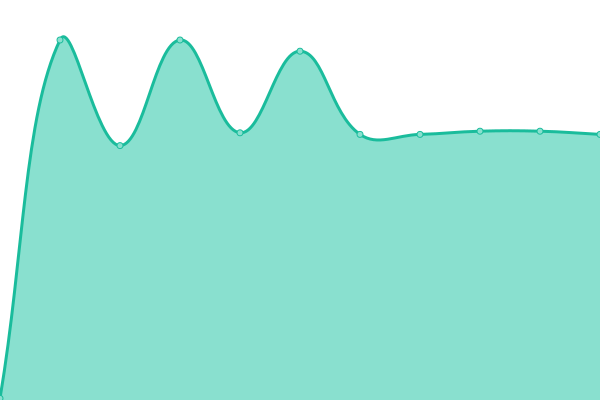
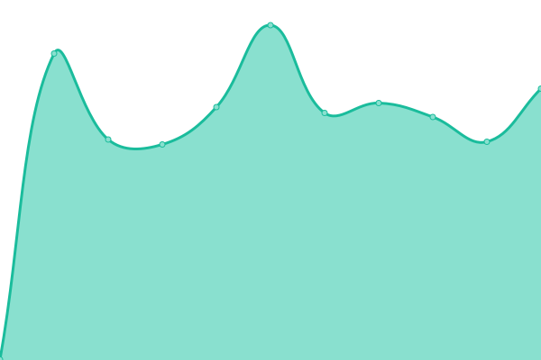
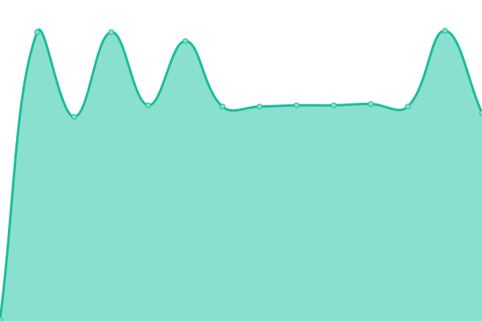

# [📈 Live Status](https:///status): <!--live status--> **🟩 All systems operational**

This repository contains the open-source uptime monitor and status page for [Upptime](https://upptime.js.org), powered by [Upptime](https://github.com/upptime/upptime).

With [Upptime](https://upptime.js.org), you can get your own unlimited and free uptime monitor and status page, powered entirely by a GitHub repository. We use [Issues](https://github.com/upptime/upptime/issues) as incident reports, [Actions](https://github.com/sbesson/status/actions) as uptime monitors, and [Pages](https:///status) for the status page.

<!--start: status pages-->
<!-- This summary is generated by Upptime (https://github.com/upptime/upptime) -->
<!-- Do not edit this manually, your changes will be overwritten -->
<!-- prettier-ignore -->
| URL | Status | History | Response Time | Uptime |
| --- | ------ | ------- | ------------- | ------ |
|  [OME website](https://www.openmicroscopy.org) | 🟩 Up | [ome-website.yml](https://github.com/sbesson/status/commits/HEAD/history/ome-website.yml) | 

 783ms
     
 | 

<a href="https://sbesson.github.io/status/history/ome-website">100.00%</a>
    

|  [OME website (alias)](https://openmicroscopy.org) | 🟩 Up | [ome-website-alias.yml](https://github.com/sbesson/status/commits/HEAD/history/ome-website-alias.yml) | 

 759ms
     
 | 

<a href="https://sbesson.github.io/status/history/ome-website-alias">100.00%</a>
    

|  [OME website (legacy)](https://www-legacy.openmicroscopy.org) | 🟩 Up | [ome-website-legacy.yml](https://github.com/sbesson/status/commits/HEAD/history/ome-website-legacy.yml) | 

 1203ms
     
 | 

<a href="https://sbesson.github.io/status/history/ome-website-legacy">100.00%</a>
    

|  [OME blog (redirected)](https://blog.openmicroscopy.org) | 🟩 Up | [ome-blog-redirected.yml](https://github.com/sbesson/status/commits/HEAD/history/ome-blog-redirected.yml) | 

 262ms
     
 | 

<a href="https://sbesson.github.io/status/history/ome-blog-redirected">100.00%</a>
    

|  [OME NGFF](https://ngff.openmicroscopy.org) | 🟩 Up | [ome-ngff.yml](https://github.com/sbesson/status/commits/HEAD/history/ome-ngff.yml) | 

 175ms
     
 | 

<a href="https://sbesson.github.io/status/history/ome-ngff">100.00%</a>
    

|  [OME forum (legacy)](https://phpbb.openmicroscopy.org) | 🟩 Up | [ome-forum-legacy.yml](https://github.com/sbesson/status/commits/HEAD/history/ome-forum-legacy.yml) | 

 880ms
     
 | 

<a href="https://sbesson.github.io/status/history/ome-forum-legacy">100.00%</a>
    

|  [OMERO figure static website (redirected)](https://figure.openmicroscopy.org) | 🟩 Up | [omero-figure-static-website-redirected.yml](https://github.com/sbesson/status/commits/HEAD/history/omero-figure-static-website-redirected.yml) | 

 211ms
     
 | 

<a href="https://sbesson.github.io/status/history/omero-figure-static-website-redirected">100.00%</a>
    

|  [OME help  (redirected)](https://help.openmicroscopy.org) | 🟩 Up | [ome-help-redirected.yml](https://github.com/sbesson/status/commits/HEAD/history/ome-help-redirected.yml) | 

 125ms
     
 | 

<a href="https://sbesson.github.io/status/history/ome-help-redirected">100.00%</a>
    

|  [OME artifactory](https://artifacts.openmicroscopy.org) | 🟩 Up | [ome-artifactory.yml](https://github.com/sbesson/status/commits/HEAD/history/ome-artifactory.yml) | 

 512ms
     
 | 

<a href="https://sbesson.github.io/status/history/ome-artifactory">100.00%</a>
    

|  [OME downloads](https://downloads.openmicroscopy.org) | 🟩 Up | [ome-downloads.yml](https://github.com/sbesson/status/commits/HEAD/history/ome-downloads.yml) | 

 534ms
     
 | 

<a href="https://sbesson.github.io/status/history/ome-downloads">100.00%</a>
    

|  [OME documentation](https://docs.openmicroscopy.org) | 🟩 Up | [ome-documentation.yml](https://github.com/sbesson/status/commits/HEAD/history/ome-documentation.yml) | 

 558ms
     
 | 

<a href="https://sbesson.github.io/status/history/ome-documentation">100.00%</a>
    

|  [OME demo server](https://demo.openmicroscopy.org) | 🟩 Up | [ome-demo-server.yml](https://github.com/sbesson/status/commits/HEAD/history/ome-demo-server.yml) | 

 789ms
     
 | 

<a href="https://sbesson.github.io/status/history/ome-demo-server">98.45%</a>
    

|  [OME XSD schemas](http://www.openmicroscopy.org/Schemas) | 🟩 Up | [ome-xsd-schemas.yml](https://github.com/sbesson/status/commits/HEAD/history/ome-xsd-schemas.yml) | 

 506ms
     
 | 

<a href="https://sbesson.github.io/status/history/ome-xsd-schemas">100.00%</a>
    

|  [OME CI server (legacy)](https://ci.openmicroscopy.org) | 🟩 Up | [ome-ci-server-legacy.yml](https://github.com/sbesson/status/commits/HEAD/history/ome-ci-server-legacy.yml) | 

 768ms
     
 | 

<a href="https://sbesson.github.io/status/history/ome-ci-server-legacy">100.00%</a>
    

|  [OME CI server (merge)](https://merge-ci.openmicroscopy.org/jenkins) | 🟩 Up | [ome-ci-server-merge.yml](https://github.com/sbesson/status/commits/HEAD/history/ome-ci-server-merge.yml) | 

 880ms
     
 | 

<a href="https://sbesson.github.io/status/history/ome-ci-server-merge">98.52%</a>
    

|  [OME CI server (latest)](https://latest-ci.openmicroscopy.org/jenkins) | 🟩 Up | [ome-ci-server-latest.yml](https://github.com/sbesson/status/commits/HEAD/history/ome-ci-server-latest.yml) | 

 1071ms
     
 | 

<a href="https://sbesson.github.io/status/history/ome-ci-server-latest">98.52%</a>
    

|  [OME training server 1](https://outreach.openmicroscopy.org) | 🟩 Up | [ome-training-server-1.yml](https://github.com/sbesson/status/commits/HEAD/history/ome-training-server-1.yml) | 

 652ms
     
 | 

<a href="https://sbesson.github.io/status/history/ome-training-server-1">100.00%</a>
    

|  [OME issue tracking system (legacy)](https://trac.openmicroscopy.org) | 🟩 Up | [ome-issue-tracking-system-legacy.yml](https://github.com/sbesson/status/commits/HEAD/history/ome-issue-tracking-system-legacy.yml) | 

 831ms
     
 | 

<a href="https://sbesson.github.io/status/history/ome-issue-tracking-system-legacy">100.00%</a>
    

|  [OME training server 2](https://workshop.openmicroscopy.org) | 🟩 Up | [ome-training-server-2.yml](https://github.com/sbesson/status/commits/HEAD/history/ome-training-server-2.yml) | 

 660ms
     
 | 

<a href="https://sbesson.github.io/status/history/ome-training-server-2">100.00%</a>
    

|  [OME Q&A](http://qa.openmicroscopy.org.uk/) | 🟩 Up | [ome-q-and-a.yml](https://github.com/sbesson/status/commits/HEAD/history/ome-q-and-a.yml) | 

 441ms
     
 | 

<a href="https://sbesson.github.io/status/history/ome-q-and-a">100.00%</a>
    

|  [OME GitHub](https://github.com/ome) | 🟩 Up | [ome-git-hub.yml](https://github.com/sbesson/status/commits/HEAD/history/ome-git-hub.yml) | 

 529ms
     
 | 

<a href="https://sbesson.github.io/status/history/ome-git-hub">100.00%</a>
    

|  OME gate (22) | 🟩 Up | [ome-gate-22.yml](https://github.com/sbesson/status/commits/HEAD/history/ome-gate-22.yml) | 

 107ms
     
 | 

<a href="https://sbesson.github.io/status/history/ome-gate-22">100.00%</a>
    

|  OME gate (443) | 🟩 Up | [ome-gate-443.yml](https://github.com/sbesson/status/commits/HEAD/history/ome-gate-443.yml) | 

 93ms
     
 | 

<a href="https://sbesson.github.io/status/history/ome-gate-443">100.00%</a>
    

|  [UoD SLS research OMERO (authenticated)](https://nightshade.openmicroscopy.org) | 🟩 Up | [uo-d-sls-research-omero-authenticated.yml](https://github.com/sbesson/status/commits/HEAD/history/uo-d-sls-research-omero-authenticated.yml) | 

 687ms
     
 | 

<a href="https://sbesson.github.io/status/history/uo-d-sls-research-omero-authenticated">100.00%</a>
    

|  [UoD SLS research OMERO (public)](https://omero.lifesci.dundee.ac.uk) | 🟩 Up | [uo-d-sls-research-omero-public.yml](https://github.com/sbesson/status/commits/HEAD/history/uo-d-sls-research-omero-public.yml) | 

 2471ms
     
 | 

<a href="https://sbesson.github.io/status/history/uo-d-sls-research-omero-public">100.00%</a>
    

|  [UoD teaching OMERO](https://learning.openmicroscopy.org) | 🟩 Up | [uo-d-teaching-omero.yml](https://github.com/sbesson/status/commits/HEAD/history/uo-d-teaching-omero.yml) | 

 684ms
     
 | 

<a href="https://sbesson.github.io/status/history/uo-d-teaching-omero">100.00%</a>
    

|  [IDR](https://idr.openmicroscopy.org) | 🟩 Up | [idr.yml](https://github.com/sbesson/status/commits/HEAD/history/idr.yml) | 

 569ms
     
 | 

<a href="https://sbesson.github.io/status/history/idr">100.00%</a>
    

|  [IDR FTP](idr-ftp.openmicroscopy.org) | 🟩 Up | [idr-ftp.yml](https://github.com/sbesson/status/commits/HEAD/history/idr-ftp.yml) | 

 116ms
     
 | 

<a href="https://sbesson.github.io/status/history/idr-ftp">100.00%</a>
    

|  [ITR](https://itr.openmicroscopy.org) | 🟩 Up | [itr.yml](https://github.com/sbesson/status/commits/HEAD/history/itr.yml) | 

 712ms
     
 | 

<a href="https://sbesson.github.io/status/history/itr">100.00%</a>
    

|  [IDR API](https://idr.openmicroscopy.org/about/api.html) | 🟩 Up | [idr-api.yml](https://github.com/sbesson/status/commits/HEAD/history/idr-api.yml) | 

 188ms
     
 | 

<a href="https://sbesson.github.io/status/history/idr-api">100.00%</a>
    

|  [IDR submission](https://idr.openmicroscopy.org/about/submission.html) | 🟩 Up | [idr-submission.yml](https://github.com/sbesson/status/commits/HEAD/history/idr-submission.yml) | 

 187ms
     
 | 

<a href="https://sbesson.github.io/status/history/idr-submission">100.00%</a>
    

|  [IDR Analysis](https://idr-analysis.openmicroscopy.org) | 🟩 Up | [idr-analysis.yml](https://github.com/sbesson/status/commits/HEAD/history/idr-analysis.yml) | 

 615ms
     
 | 

<a href="https://sbesson.github.io/status/history/idr-analysis">100.00%</a>
    

|  [IDR Jupyter](https://idr.openmicroscopy.org/jupyter) | 🟩 Up | [idr-jupyter.yml](https://github.com/sbesson/status/commits/HEAD/history/idr-jupyter.yml) | 

 187ms
     
 | 

<a href="https://sbesson.github.io/status/history/idr-jupyter">100.00%</a>
    

<!--end: status pages-->

[**Visit our status website →**](https:///status)

## 📄 License

- Powered by: [Upptime](https://github.com/upptime/upptime)
- Code: [MIT](./LICENSE) © [Upptime](https://upptime.js.org)
- Data in the `./history` directory: [Open Database License](https://opendatacommons.org/licenses/odbl/1-0/)
