# [📈 Live Status](https://ome.github.io/upptime): <!--live status--> **🟧 Partial outage**

This repository contains the open-source uptime monitor and status page for [Upptime](https://upptime.js.org), powered by [Upptime](https://github.com/upptime/upptime).

With [Upptime](https://upptime.js.org), you can get your own unlimited and free uptime monitor and status page, powered entirely by a GitHub repository. We use [Issues](https://github.com/upptime/upptime/issues) as incident reports, [Actions](https://github.com/ome/upptime/actions) as uptime monitors, and [Pages](https://ome.github.io/upptime) for the status page.

<!--start: status pages-->
<!-- This summary is generated by Upptime (https://github.com/upptime/upptime) -->
<!-- Do not edit this manually, your changes will be overwritten -->
<!-- prettier-ignore -->
| URL | Status | History | Response Time | Uptime |
| --- | ------ | ------- | ------------- | ------ |
|  [OME website](https://www.openmicroscopy.org) | 🟩 Up | [ome-website.yml](https://github.com/ome/upptime/commits/HEAD/history/ome-website.yml) | 

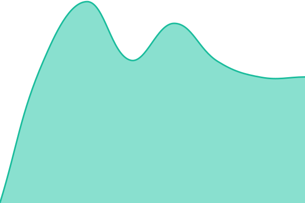 670ms
     
 | 

<a href="https://ome.github.io/upptime/history/ome-website">100.00%</a>
    

|  [OME website (alias)](https://openmicroscopy.org) | 🟩 Up | [ome-website-alias.yml](https://github.com/ome/upptime/commits/HEAD/history/ome-website-alias.yml) | 

 1004ms
     
 | 

<a href="https://ome.github.io/upptime/history/ome-website-alias">100.00%</a>
    

|  [OME website (legacy)](https://www-legacy.openmicroscopy.org) | 🟩 Up | [ome-website-legacy.yml](https://github.com/ome/upptime/commits/HEAD/history/ome-website-legacy.yml) | 

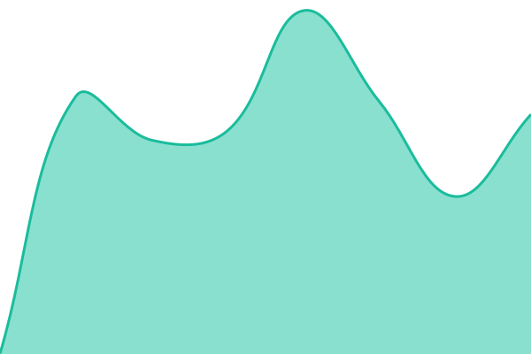 685ms
     
 | 

<a href="https://ome.github.io/upptime/history/ome-website-legacy">100.00%</a>
    

|  [OME blog (redirected)](https://blog.openmicroscopy.org) | 🟩 Up | [ome-blog-redirected.yml](https://github.com/ome/upptime/commits/HEAD/history/ome-blog-redirected.yml) | 

 170ms
     
 | 

<a href="https://ome.github.io/upptime/history/ome-blog-redirected">100.00%</a>
    

|  [OME NGFF](https://ngff.openmicroscopy.org) | 🟩 Up | [ome-ngff.yml](https://github.com/ome/upptime/commits/HEAD/history/ome-ngff.yml) | 

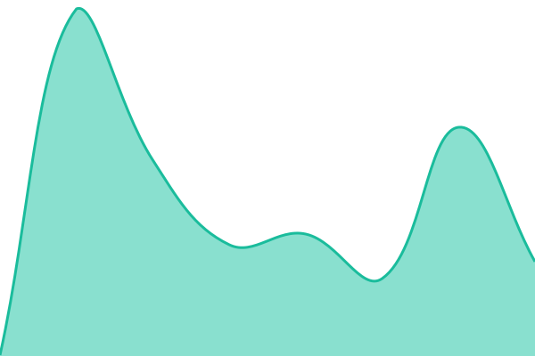 124ms
     
 | 

<a href="https://ome.github.io/upptime/history/ome-ngff">100.00%</a>
    

|  [OME forum (legacy)](https://phpbb.openmicroscopy.org) | 🟩 Up | [ome-forum-legacy.yml](https://github.com/ome/upptime/commits/HEAD/history/ome-forum-legacy.yml) | 

 1557ms
     
 | 

<a href="https://ome.github.io/upptime/history/ome-forum-legacy">100.00%</a>
    

|  [OMERO figure static website (redirected)](https://figure.openmicroscopy.org) | 🟩 Up | [omero-figure-static-website-redirected.yml](https://github.com/ome/upptime/commits/HEAD/history/omero-figure-static-website-redirected.yml) | 

 140ms
     
 | 

<a href="https://ome.github.io/upptime/history/omero-figure-static-website-redirected">100.00%</a>
    

|  [OME help (redirected)](https://help.openmicroscopy.org) | 🟩 Up | [ome-help-redirected.yml](https://github.com/ome/upptime/commits/HEAD/history/ome-help-redirected.yml) | 

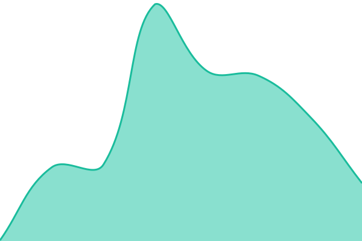 156ms
     
 | 

<a href="https://ome.github.io/upptime/history/ome-help-redirected">100.00%</a>
    

|  [OME contributing](https://ome-contributing.readthedocs.io/en/latest/) | 🟩 Up | [ome-contributing.yml](https://github.com/ome/upptime/commits/HEAD/history/ome-contributing.yml) | 

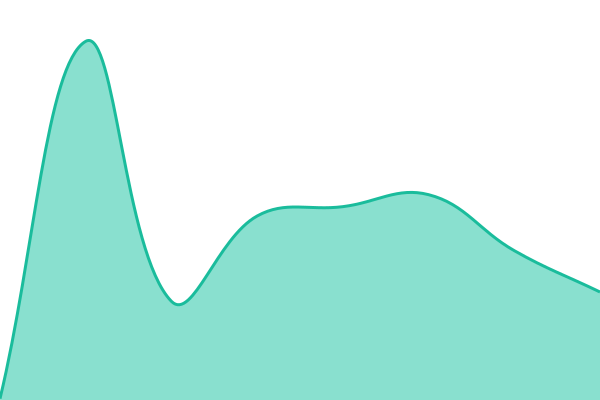 81ms
     
 | 

<a href="https://ome.github.io/upptime/history/ome-contributing">100.00%</a>
    

|  [OME contributing (redirected)](https://www.openmicroscopy.org/site/support/contributing/) | 🟩 Up | [ome-contributing-redirected.yml](https://github.com/ome/upptime/commits/HEAD/history/ome-contributing-redirected.yml) | 

 885ms
     
 | 

<a href="https://ome.github.io/upptime/history/ome-contributing-redirected">100.00%</a>
    

|  [OME artifactory](https://artifacts.openmicroscopy.org) | 🟩 Up | [ome-artifactory.yml](https://github.com/ome/upptime/commits/HEAD/history/ome-artifactory.yml) | 

 980ms
     
 | 

<a href="https://ome.github.io/upptime/history/ome-artifactory">100.00%</a>
    

|  [OME downloads](https://downloads.openmicroscopy.org) | 🟩 Up | [ome-downloads.yml](https://github.com/ome/upptime/commits/HEAD/history/ome-downloads.yml) | 

 423ms
     
 | 

<a href="https://ome.github.io/upptime/history/ome-downloads">100.00%</a>
    

|  [OME documentation](https://docs.openmicroscopy.org) | 🟩 Up | [ome-documentation.yml](https://github.com/ome/upptime/commits/HEAD/history/ome-documentation.yml) | 

 407ms
     
 | 

<a href="https://ome.github.io/upptime/history/ome-documentation">100.00%</a>
    

|  [OME demo server](https://demo.openmicroscopy.org) | 🟩 Up | [ome-demo-server.yml](https://github.com/ome/upptime/commits/HEAD/history/ome-demo-server.yml) | 

 1561ms
     
 | 

<a href="https://ome.github.io/upptime/history/ome-demo-server">100.00%</a>
    

|  [OME XSD schemas](http://www.openmicroscopy.org/Schemas) | 🟩 Up | [ome-xsd-schemas.yml](https://github.com/ome/upptime/commits/HEAD/history/ome-xsd-schemas.yml) | 

 1075ms
     
 | 

<a href="https://ome.github.io/upptime/history/ome-xsd-schemas">100.00%</a>
    

|  [OME CI server (legacy)](https://ci.openmicroscopy.org) | 🟥 Down | [ome-ci-server-legacy.yml](https://github.com/ome/upptime/commits/HEAD/history/ome-ci-server-legacy.yml) | 

 1200ms
     
 | 

<a href="https://ome.github.io/upptime/history/ome-ci-server-legacy">0.00%</a>
    

|  [OME CI server (merge)](https://merge-ci.openmicroscopy.org/jenkins) | 🟥 Down | [ome-ci-server-merge.yml](https://github.com/ome/upptime/commits/HEAD/history/ome-ci-server-merge.yml) | 

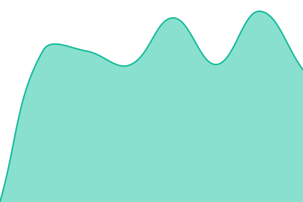 789ms
     
 | 

<a href="https://ome.github.io/upptime/history/ome-ci-server-merge">0.00%</a>
    

|  [OME CI server (latest)](https://latest-ci.openmicroscopy.org/jenkins) | 🟥 Down | [ome-ci-server-latest.yml](https://github.com/ome/upptime/commits/HEAD/history/ome-ci-server-latest.yml) | 

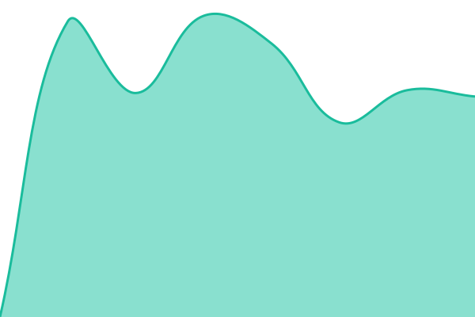 1205ms
     
 | 

<a href="https://ome.github.io/upptime/history/ome-ci-server-latest">0.00%</a>
    

|  [OME training server 1](https://outreach.openmicroscopy.org) | 🟩 Up | [ome-training-server-1.yml](https://github.com/ome/upptime/commits/HEAD/history/ome-training-server-1.yml) | 

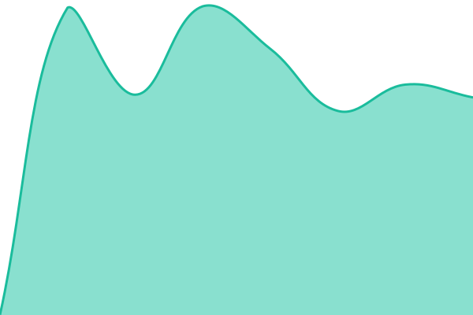 1269ms
     
 | 

<a href="https://ome.github.io/upptime/history/ome-training-server-1">100.00%</a>
    

|  [OME issue tracking system (legacy)](https://trac.openmicroscopy.org) | 🟩 Up | [ome-issue-tracking-system-legacy.yml](https://github.com/ome/upptime/commits/HEAD/history/ome-issue-tracking-system-legacy.yml) | 

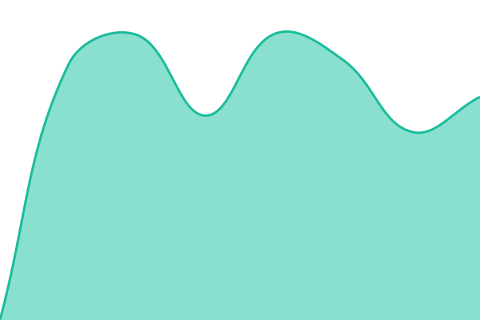 1354ms
     
 | 

<a href="https://ome.github.io/upptime/history/ome-issue-tracking-system-legacy">100.00%</a>
    

|  [OME file formats (redirected)](http://www.openmicroscopy.org/site/support/file-formats) | 🟥 Down | [ome-file-formats-redirected.yml](https://github.com/ome/upptime/commits/HEAD/history/ome-file-formats-redirected.yml) | 

 0ms
     
 | 

<a href="https://ome.github.io/upptime/history/ome-file-formats-redirected">100.00%</a>
    

|  [OME units documentation (redirected)](https://www.openmicroscopy.org/site/support/ome-model/developers/ome-units.html) | 🟩 Up | [ome-units-documentation-redirected.yml](https://github.com/ome/upptime/commits/HEAD/history/ome-units-documentation-redirected.yml) | 

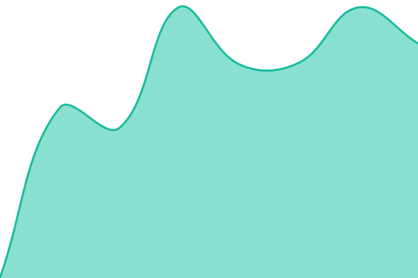 1277ms
     
 | 

<a href="https://ome.github.io/upptime/history/ome-units-documentation-redirected">100.00%</a>
    

|  [OME training server 2](https://workshop.openmicroscopy.org) | 🟩 Up | [ome-training-server-2.yml](https://github.com/ome/upptime/commits/HEAD/history/ome-training-server-2.yml) | 

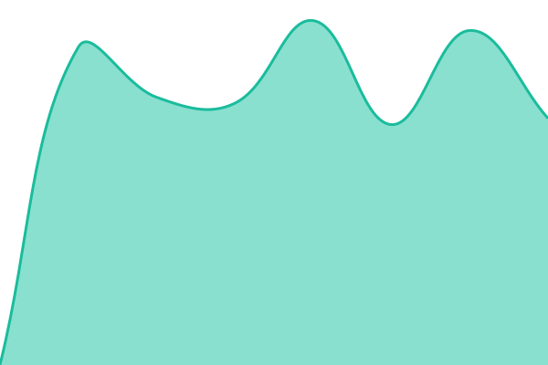 1285ms
     
 | 

<a href="https://ome.github.io/upptime/history/ome-training-server-2">100.00%</a>
    

|  [OME Q&A](http://qa.openmicroscopy.org.uk/) | 🟩 Up | [ome-q-and-a.yml](https://github.com/ome/upptime/commits/HEAD/history/ome-q-and-a.yml) | 

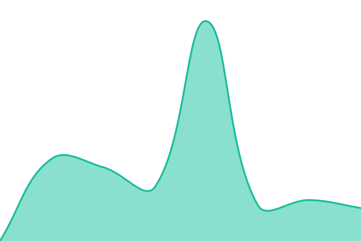 1033ms
     
 | 

<a href="https://ome.github.io/upptime/history/ome-q-and-a">96.00%</a>
    

|  OME gate (22) | 🟥 Down | [ome-gate-22.yml](https://github.com/ome/upptime/commits/HEAD/history/ome-gate-22.yml) | 

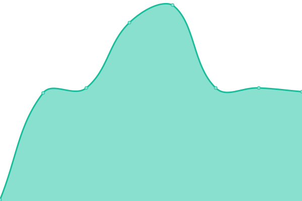 0ms
     
 | 

<a href="https://ome.github.io/upptime/history/ome-gate-22">99.80%</a>
    

|  OME gate (443) | 🟥 Down | [ome-gate-443.yml](https://github.com/ome/upptime/commits/HEAD/history/ome-gate-443.yml) | 

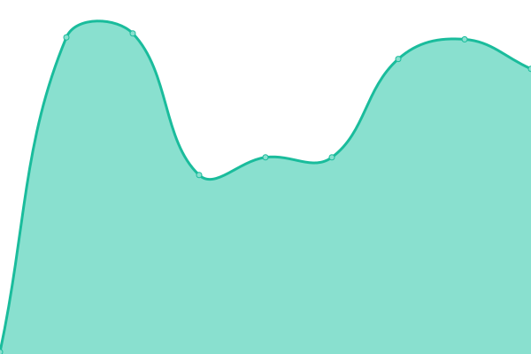 0ms
     
 | 

<a href="https://ome.github.io/upptime/history/ome-gate-443">99.84%</a>
    

|  [UoD SLS OMERO (authenticated)](https://nightshade.openmicroscopy.org) | 🟩 Up | [uo-d-sls-omero-authenticated.yml](https://github.com/ome/upptime/commits/HEAD/history/uo-d-sls-omero-authenticated.yml) | 

 1794ms
     
 | 

<a href="https://ome.github.io/upptime/history/uo-d-sls-omero-authenticated">100.00%</a>
    

|  [UoD SLS OMERO (4063)](nightshade.openmicroscopy.org) | 🟩 Up | [uo-d-sls-omero-4063.yml](https://github.com/ome/upptime/commits/HEAD/history/uo-d-sls-omero-4063.yml) | 

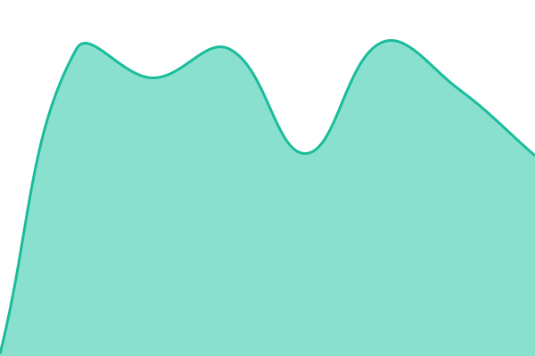 129ms
     
 | 

<a href="https://ome.github.io/upptime/history/uo-d-sls-omero-4063">100.00%</a>
    

|  [UoD SLS OMERO (4064)](nightshade.openmicroscopy.org) | 🟩 Up | [uo-d-sls-omero-4064.yml](https://github.com/ome/upptime/commits/HEAD/history/uo-d-sls-omero-4064.yml) | 

 128ms
     
 | 

<a href="https://ome.github.io/upptime/history/uo-d-sls-omero-4064">100.00%</a>
    

|  [UoD SLS OMERO (public)](https://omero.lifesci.dundee.ac.uk) | 🟩 Up | [uo-d-sls-omero-public.yml](https://github.com/ome/upptime/commits/HEAD/history/uo-d-sls-omero-public.yml) | 

 7736ms
     
 | 

<a href="https://ome.github.io/upptime/history/uo-d-sls-omero-public">100.00%</a>
    

|  [UoD SLS OMERO (image 3925540 - render_thumbnail)](https://omero.lifesci.dundee.ac.uk/webgateway/render_thumbnail/3925540/) | 🟩 Up | [uo-d-sls-omero-image-3925540-render-thumbnail.yml](https://github.com/ome/upptime/commits/HEAD/history/uo-d-sls-omero-image-3925540-render-thumbnail.yml) | 

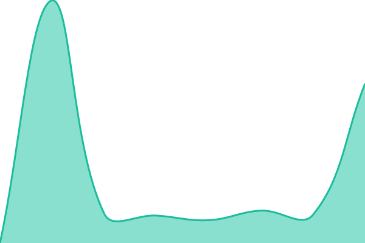 2594ms
     
 | 

<a href="https://ome.github.io/upptime/history/uo-d-sls-omero-image-3925540-render-thumbnail">100.00%</a>
    

|  [UoD SLS OMERO (image 3925540 - render_image)](https://omero.lifesci.dundee.ac.uk/webgateway/render_image/3925540/3/5/) | 🟩 Up | [uo-d-sls-omero-image-3925540-render-image.yml](https://github.com/ome/upptime/commits/HEAD/history/uo-d-sls-omero-image-3925540-render-image.yml) | 

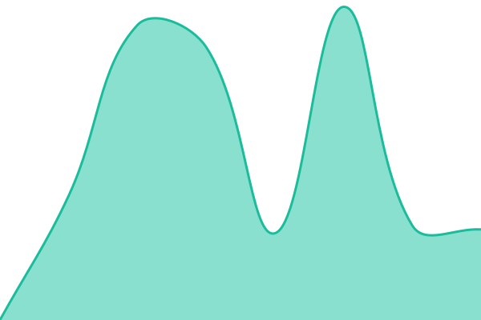 2299ms
     
 | 

<a href="https://ome.github.io/upptime/history/uo-d-sls-omero-image-3925540-render-image">100.00%</a>
    

|  [UoD SLS OMERO (image 3925540 - img_detail)](https://omero.lifesci.dundee.ac.uk/webgateway/img_detail/3925540/) | 🟩 Up | [uo-d-sls-omero-image-3925540-img-detail.yml](https://github.com/ome/upptime/commits/HEAD/history/uo-d-sls-omero-image-3925540-img-detail.yml) | 

 2178ms
     
 | 

<a href="https://ome.github.io/upptime/history/uo-d-sls-omero-image-3925540-img-detail">100.00%</a>
    

|  [UoD SLS OMERO (10.17867/10000109)](http://dx.doi.org/10.17867/10000109) | 🟩 Up | [uo-d-sls-omero-10-17867-10000109.yml](https://github.com/ome/upptime/commits/HEAD/history/uo-d-sls-omero-10-17867-10000109.yml) | 

 4173ms
     
 | 

<a href="https://ome.github.io/upptime/history/uo-d-sls-omero-10-17867-10000109">100.00%</a>
    

|  [UoD teaching OMERO](https://learning.openmicroscopy.org) | 🟩 Up | [uo-d-teaching-omero.yml](https://github.com/ome/upptime/commits/HEAD/history/uo-d-teaching-omero.yml) | 

 1356ms
     
 | 

<a href="https://ome.github.io/upptime/history/uo-d-teaching-omero">100.00%</a>
    

|  [UGM OMERO](https://ugm.openmicroscopy.org) | 🟩 Up | [ugm-omero.yml](https://github.com/ome/upptime/commits/HEAD/history/ugm-omero.yml) | 

 1361ms
     
 | 

<a href="https://ome.github.io/upptime/history/ugm-omero">100.00%</a>
    

|  [UGM OMERO (4063)](ugm.openmicroscopy.org) | 🟩 Up | [ugm-omero-4063.yml](https://github.com/ome/upptime/commits/HEAD/history/ugm-omero-4063.yml) | 

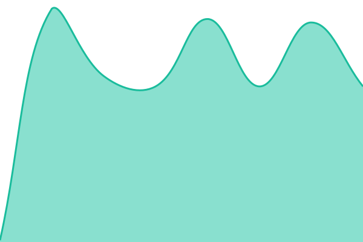 127ms
     
 | 

<a href="https://ome.github.io/upptime/history/ugm-omero-4063">100.00%</a>
    

|  [UGM OMERO (4064)](ugm.openmicroscopy.org) | 🟩 Up | [ugm-omero-4064.yml](https://github.com/ome/upptime/commits/HEAD/history/ugm-omero-4064.yml) | 

 127ms
     
 | 

<a href="https://ome.github.io/upptime/history/ugm-omero-4064">100.00%</a>
    

<!--end: status pages-->

[**Visit our status website →**](https://ome.github.io/upptime)

## 📄 License

- Powered by: [Upptime](https://github.com/upptime/upptime)
- Code: [MIT](./LICENSE) © [Upptime](https://upptime.js.org)
- Data in the `./history` directory: [Open Database License](https://opendatacommons.org/licenses/odbl/1-0/)
