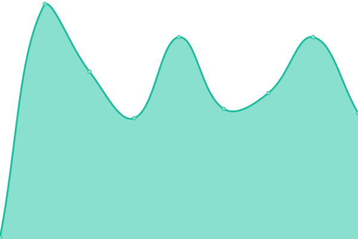

# [📈 Live Status](https:///status): <!--live status--> **🟩 All systems operational**

This repository contains the open-source uptime monitor and status page for [Upptime](https://upptime.js.org), powered by [Upptime](https://github.com/upptime/upptime).

With [Upptime](https://upptime.js.org), you can get your own unlimited and free uptime monitor and status page, powered entirely by a GitHub repository. We use [Issues](https://github.com/upptime/upptime/issues) as incident reports, [Actions](https://github.com/sbesson/status/actions) as uptime monitors, and [Pages](https:///status) for the status page.

<!--start: status pages-->
<!-- This summary is generated by Upptime (https://github.com/upptime/upptime) -->
<!-- Do not edit this manually, your changes will be overwritten -->
<!-- prettier-ignore -->
| URL | Status | History | Response Time | Uptime |
| --- | ------ | ------- | ------------- | ------ |
|  [OME website](https://www.openmicroscopy.org) | 🟩 Up | [ome-website.yml](https://github.com/sbesson/status/commits/HEAD/history/ome-website.yml) | 

 830ms
     
 | 

<a href="https://sbesson.github.io/status/history/ome-website">100.00%</a>
    

|  [OME artifactory](https://artifacts.openmicroscopy.org) | 🟩 Up | [ome-artifactory.yml](https://github.com/sbesson/status/commits/HEAD/history/ome-artifactory.yml) | 

 594ms
     
 | 

<a href="https://sbesson.github.io/status/history/ome-artifactory">100.00%</a>
    

|  [OME downloads](https://downloads.openmicroscopy.org) | 🟩 Up | [ome-downloads.yml](https://github.com/sbesson/status/commits/HEAD/history/ome-downloads.yml) | 

 564ms
     
 | 

<a href="https://sbesson.github.io/status/history/ome-downloads">100.00%</a>
    

|  [OME documentation](https://docs.openmicroscopy.org) | 🟩 Up | [ome-documentation.yml](https://github.com/sbesson/status/commits/HEAD/history/ome-documentation.yml) | 

 574ms
     
 | 

<a href="https://sbesson.github.io/status/history/ome-documentation">100.00%</a>
    

|  [OME demo server](https://demo.openmicroscopy.org) | 🟩 Up | [ome-demo-server.yml](https://github.com/sbesson/status/commits/HEAD/history/ome-demo-server.yml) | 

 909ms
     
 | 

<a href="https://sbesson.github.io/status/history/ome-demo-server">100.00%</a>
    

|  [UoD SLS research OMERO instance](https://nightshade.openmicroscopy.org) | 🟩 Up | [uo-d-sls-research-omero-instance.yml](https://github.com/sbesson/status/commits/HEAD/history/uo-d-sls-research-omero-instance.yml) | 

 915ms
     
 | 

<a href="https://sbesson.github.io/status/history/uo-d-sls-research-omero-instance">100.00%</a>
    

|  [Public UoD research SLS OMERO instance](https://omero.lifesci.dundee.ac.uk) | 🟩 Up | [public-uo-d-research-sls-omero-instance.yml](https://github.com/sbesson/status/commits/HEAD/history/public-uo-d-research-sls-omero-instance.yml) | 

 2249ms
     
 | 

<a href="https://sbesson.github.io/status/history/public-uo-d-research-sls-omero-instance">100.00%</a>
    

|  [Image Data Resource](http://idr.openmicroscopy.org) | 🟩 Up | [image-data-resource.yml](https://github.com/sbesson/status/commits/HEAD/history/image-data-resource.yml) | 

 317ms
     
 | 

<a href="https://sbesson.github.io/status/history/image-data-resource">100.00%</a>
    

|  [OME XSD schemas](http://www.openmicroscopy.org/Schemas) | 🟩 Up | [ome-xsd-schemas.yml](https://github.com/sbesson/status/commits/HEAD/history/ome-xsd-schemas.yml) | 

 562ms
     
 | 

<a href="https://sbesson.github.io/status/history/ome-xsd-schemas">100.00%</a>
    

<!--end: status pages-->

[**Visit our status website →**](https:///status)

## 📄 License

- Powered by: [Upptime](https://github.com/upptime/upptime)
- Code: [MIT](./LICENSE) © [Upptime](https://upptime.js.org)
- Data in the `./history` directory: [Open Database License](https://opendatacommons.org/licenses/odbl/1-0/)
