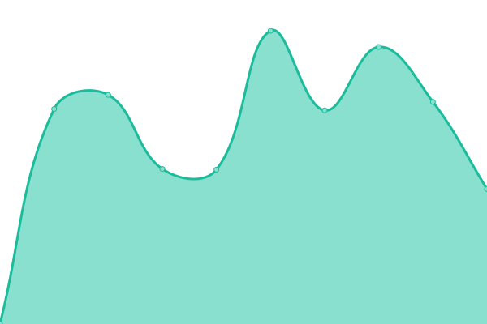

# [📈 Live Status](https://ome.github.io/upptime): <!--live status--> **🟩 All systems operational**

This repository contains the open-source uptime monitor and status page for [Upptime](https://upptime.js.org), powered by [Upptime](https://github.com/upptime/upptime).

With [Upptime](https://upptime.js.org), you can get your own unlimited and free uptime monitor and status page, powered entirely by a GitHub repository. We use [Issues](https://github.com/upptime/upptime/issues) as incident reports, [Actions](https://github.com/ome/upptime/actions) as uptime monitors, and [Pages](https://ome.github.io/upptime) for the status page.

<!--start: status pages-->
<!-- This summary is generated by Upptime (https://github.com/upptime/upptime) -->
<!-- Do not edit this manually, your changes will be overwritten -->
<!-- prettier-ignore -->
| URL | Status | History | Response Time | Uptime |
| --- | ------ | ------- | ------------- | ------ |
|  [OME website](https://www.openmicroscopy.org) | 🟩 Up | [ome-website.yml](https://github.com/ome/upptime/commits/HEAD/history/ome-website.yml) | 

 747ms
     
 | 

<a href="https://ome.github.io/upptime/history/ome-website">56.31%</a>
    

|  [OME website (alias)](https://openmicroscopy.org) | 🟩 Up | [ome-website-alias.yml](https://github.com/ome/upptime/commits/HEAD/history/ome-website-alias.yml) | 

 712ms
     
 | 

<a href="https://ome.github.io/upptime/history/ome-website-alias">56.14%</a>
    

|  [OME website (legacy)](https://www-legacy.openmicroscopy.org) | 🟩 Up | [ome-website-legacy.yml](https://github.com/ome/upptime/commits/HEAD/history/ome-website-legacy.yml) | 

 2284ms
     
 | 

<a href="https://ome.github.io/upptime/history/ome-website-legacy">96.10%</a>
    

|  [OME blog (redirected)](https://blog.openmicroscopy.org) | 🟩 Up | [ome-blog-redirected.yml](https://github.com/ome/upptime/commits/HEAD/history/ome-blog-redirected.yml) | 

 189ms
     
 | 

<a href="https://ome.github.io/upptime/history/ome-blog-redirected">100.00%</a>
    

|  [OME NGFF](https://ngff.openmicroscopy.org) | 🟩 Up | [ome-ngff.yml](https://github.com/ome/upptime/commits/HEAD/history/ome-ngff.yml) | 

 184ms
     
 | 

<a href="https://ome.github.io/upptime/history/ome-ngff">100.00%</a>
    

|  [OME forum (legacy)](https://phpbb.openmicroscopy.org) | 🟩 Up | [ome-forum-legacy.yml](https://github.com/ome/upptime/commits/HEAD/history/ome-forum-legacy.yml) | 

 883ms
     
 | 

<a href="https://ome.github.io/upptime/history/ome-forum-legacy">56.18%</a>
    

|  [OMERO figure static website (redirected)](https://figure.openmicroscopy.org) | 🟩 Up | [omero-figure-static-website-redirected.yml](https://github.com/ome/upptime/commits/HEAD/history/omero-figure-static-website-redirected.yml) | 

 715ms
     
 | 

<a href="https://ome.github.io/upptime/history/omero-figure-static-website-redirected">100.00%</a>
    

|  [OME help (redirected)](https://help.openmicroscopy.org) | 🟩 Up | [ome-help-redirected.yml](https://github.com/ome/upptime/commits/HEAD/history/ome-help-redirected.yml) | 

 176ms
     
 | 

<a href="https://ome.github.io/upptime/history/ome-help-redirected">100.00%</a>
    

|  [OME contributing](https://ome-contributing.readthedocs.io/en/latest/) | 🟩 Up | [ome-contributing.yml](https://github.com/ome/upptime/commits/HEAD/history/ome-contributing.yml) | 

 113ms
     
 | 

<a href="https://ome.github.io/upptime/history/ome-contributing">100.00%</a>
    

|  [OME contributing (redirected)](https://www.openmicroscopy.org/site/support/contributing/) | 🟩 Up | [ome-contributing-redirected.yml](https://github.com/ome/upptime/commits/HEAD/history/ome-contributing-redirected.yml) | 

 704ms
     
 | 

<a href="https://ome.github.io/upptime/history/ome-contributing-redirected">56.40%</a>
    

|  [OME artifactory](https://artifacts.openmicroscopy.org) | 🟩 Up | [ome-artifactory.yml](https://github.com/ome/upptime/commits/HEAD/history/ome-artifactory.yml) | 

 1113ms
     
 | 

<a href="https://ome.github.io/upptime/history/ome-artifactory">96.17%</a>
    

|  [OME downloads](https://downloads.openmicroscopy.org) | 🟩 Up | [ome-downloads.yml](https://github.com/ome/upptime/commits/HEAD/history/ome-downloads.yml) | 

 1126ms
     
 | 

<a href="https://ome.github.io/upptime/history/ome-downloads">96.19%</a>
    

|  [OME documentation](https://docs.openmicroscopy.org) | 🟩 Up | [ome-documentation.yml](https://github.com/ome/upptime/commits/HEAD/history/ome-documentation.yml) | 

 684ms
     
 | 

<a href="https://ome.github.io/upptime/history/ome-documentation">96.21%</a>
    

|  [OME demo server](https://demo.openmicroscopy.org) | 🟩 Up | [ome-demo-server.yml](https://github.com/ome/upptime/commits/HEAD/history/ome-demo-server.yml) | 

 1071ms
     
 | 

<a href="https://ome.github.io/upptime/history/ome-demo-server">96.36%</a>
    

|  [OME XSD schemas](http://www.openmicroscopy.org/Schemas) | 🟩 Up | [ome-xsd-schemas.yml](https://github.com/ome/upptime/commits/HEAD/history/ome-xsd-schemas.yml) | 

 364ms
     
 | 

<a href="https://ome.github.io/upptime/history/ome-xsd-schemas">96.03%</a>
    

|  [OME CI server (legacy)](https://ci.openmicroscopy.org) | 🟩 Up | [ome-ci-server-legacy.yml](https://github.com/ome/upptime/commits/HEAD/history/ome-ci-server-legacy.yml) | 

 855ms
     
 | 

<a href="https://ome.github.io/upptime/history/ome-ci-server-legacy">96.05%</a>
    

|  [OME CI server (merge)](https://merge-ci.openmicroscopy.org/jenkins) | 🟩 Up | [ome-ci-server-merge.yml](https://github.com/ome/upptime/commits/HEAD/history/ome-ci-server-merge.yml) | 

 849ms
     
 | 

<a href="https://ome.github.io/upptime/history/ome-ci-server-merge">96.15%</a>
    

|  [OME CI server (latest)](https://latest-ci.openmicroscopy.org/jenkins) | 🟩 Up | [ome-ci-server-latest.yml](https://github.com/ome/upptime/commits/HEAD/history/ome-ci-server-latest.yml) | 

 860ms
     
 | 

<a href="https://ome.github.io/upptime/history/ome-ci-server-latest">96.17%</a>
    

|  [OME training server 1](https://outreach.openmicroscopy.org) | 🟩 Up | [ome-training-server-1.yml](https://github.com/ome/upptime/commits/HEAD/history/ome-training-server-1.yml) | 

 1203ms
     
 | 

<a href="https://ome.github.io/upptime/history/ome-training-server-1">96.04%</a>
    

|  [OME issue tracking system (legacy)](https://trac.openmicroscopy.org) | 🟩 Up | [ome-issue-tracking-system-legacy.yml](https://github.com/ome/upptime/commits/HEAD/history/ome-issue-tracking-system-legacy.yml) | 

 1440ms
     
 | 

<a href="https://ome.github.io/upptime/history/ome-issue-tracking-system-legacy">56.69%</a>
    

|  [OME file formats (redirected)](http://www.openmicroscopy.org/site/support/file-formats) | 🟩 Up | [ome-file-formats-redirected.yml](https://github.com/ome/upptime/commits/HEAD/history/ome-file-formats-redirected.yml) | 

 1279ms
     
 | 

<a href="https://ome.github.io/upptime/history/ome-file-formats-redirected">95.88%</a>
    

|  [OME units documentation (redirected)](https://www.openmicroscopy.org/site/support/ome-model/developers/ome-units.html) | 🟩 Up | [ome-units-documentation-redirected.yml](https://github.com/ome/upptime/commits/HEAD/history/ome-units-documentation-redirected.yml) | 

 2656ms
     
 | 

<a href="https://ome.github.io/upptime/history/ome-units-documentation-redirected">96.10%</a>
    

|  [OME training server 2](https://workshop.openmicroscopy.org) | 🟩 Up | [ome-training-server-2.yml](https://github.com/ome/upptime/commits/HEAD/history/ome-training-server-2.yml) | 

 1256ms
     
 | 

<a href="https://ome.github.io/upptime/history/ome-training-server-2">96.38%</a>
    

|  [OME Q&A](http://qa.openmicroscopy.org.uk/) | 🟩 Up | [ome-q-and-a.yml](https://github.com/ome/upptime/commits/HEAD/history/ome-q-and-a.yml) | 

 466ms
     
 | 

<a href="https://ome.github.io/upptime/history/ome-q-and-a">96.32%</a>
    

|  OME gate (22) | 🟩 Up | [ome-gate-22.yml](https://github.com/ome/upptime/commits/HEAD/history/ome-gate-22.yml) | 

 180ms
     
 | 

<a href="https://ome.github.io/upptime/history/ome-gate-22">96.43%</a>
    

|  OME gate (443) | 🟩 Up | [ome-gate-443.yml](https://github.com/ome/upptime/commits/HEAD/history/ome-gate-443.yml) | 

 134ms
     
 | 

<a href="https://ome.github.io/upptime/history/ome-gate-443">96.49%</a>
    

|  [UoD SLS OMERO (authenticated)](https://nightshade.openmicroscopy.org) | 🟩 Up | [uo-d-sls-omero-authenticated.yml](https://github.com/ome/upptime/commits/HEAD/history/uo-d-sls-omero-authenticated.yml) | 

 800ms
     
 | 

<a href="https://ome.github.io/upptime/history/uo-d-sls-omero-authenticated">96.51%</a>
    

|  [UoD SLS OMERO (4063)](nightshade.openmicroscopy.org) | 🟩 Up | [uo-d-sls-omero-4063.yml](https://github.com/ome/upptime/commits/HEAD/history/uo-d-sls-omero-4063.yml) | 

 132ms
     
 | 

<a href="https://ome.github.io/upptime/history/uo-d-sls-omero-4063">96.56%</a>
    

|  [UoD SLS OMERO (4064)](nightshade.openmicroscopy.org) | 🟩 Up | [uo-d-sls-omero-4064.yml](https://github.com/ome/upptime/commits/HEAD/history/uo-d-sls-omero-4064.yml) | 

 133ms
     
 | 

<a href="https://ome.github.io/upptime/history/uo-d-sls-omero-4064">96.85%</a>
    

|  [UoD SLS OMERO (public)](https://omero.lifesci.dundee.ac.uk) | 🟩 Up | [uo-d-sls-omero-public.yml](https://github.com/ome/upptime/commits/HEAD/history/uo-d-sls-omero-public.yml) | 

 5689ms
     
 | 

<a href="https://ome.github.io/upptime/history/uo-d-sls-omero-public">96.86%</a>
    

|  [UoD SLS OMERO (image 3925540 - render_thumbnail)](https://omero.lifesci.dundee.ac.uk/webgateway/render_thumbnail/3925540/) | 🟩 Up | [uo-d-sls-omero-image-3925540-render-thumbnail.yml](https://github.com/ome/upptime/commits/HEAD/history/uo-d-sls-omero-image-3925540-render-thumbnail.yml) | 

 351ms
     
 | 

<a href="https://ome.github.io/upptime/history/uo-d-sls-omero-image-3925540-render-thumbnail">96.88%</a>
    

|  [UoD SLS OMERO (image 3925540 - render_image)](https://omero.lifesci.dundee.ac.uk/webgateway/render_image/3925540/3/5/) | 🟩 Up | [uo-d-sls-omero-image-3925540-render-image.yml](https://github.com/ome/upptime/commits/HEAD/history/uo-d-sls-omero-image-3925540-render-image.yml) | 

 931ms
     
 | 

<a href="https://ome.github.io/upptime/history/uo-d-sls-omero-image-3925540-render-image">96.89%</a>
    

|  [UoD SLS OMERO (image 3925540 - img_detail)](https://omero.lifesci.dundee.ac.uk/webgateway/img_detail/3925540/) | 🟩 Up | [uo-d-sls-omero-image-3925540-img-detail.yml](https://github.com/ome/upptime/commits/HEAD/history/uo-d-sls-omero-image-3925540-img-detail.yml) | 

 489ms
     
 | 

<a href="https://ome.github.io/upptime/history/uo-d-sls-omero-image-3925540-img-detail">96.91%</a>
    

|  [UoD SLS OMERO (10.17867/10000109)](http://dx.doi.org/10.17867/10000109) | 🟩 Up | [uo-d-sls-omero-10-17867-10000109.yml](https://github.com/ome/upptime/commits/HEAD/history/uo-d-sls-omero-10-17867-10000109.yml) | 

 2322ms
     
 | 

<a href="https://ome.github.io/upptime/history/uo-d-sls-omero-10-17867-10000109">96.93%</a>
    

|  [UoD teaching OMERO](https://learning.openmicroscopy.org) | 🟩 Up | [uo-d-teaching-omero.yml](https://github.com/ome/upptime/commits/HEAD/history/uo-d-teaching-omero.yml) | 

 2731ms
     
 | 

<a href="https://ome.github.io/upptime/history/uo-d-teaching-omero">96.77%</a>
    

<!--end: status pages-->

[**Visit our status website →**](https://ome.github.io/upptime)

## 📄 License

- Powered by: [Upptime](https://github.com/upptime/upptime)
- Code: [MIT](./LICENSE) © [Upptime](https://upptime.js.org)
- Data in the `./history` directory: [Open Database License](https://opendatacommons.org/licenses/odbl/1-0/)
