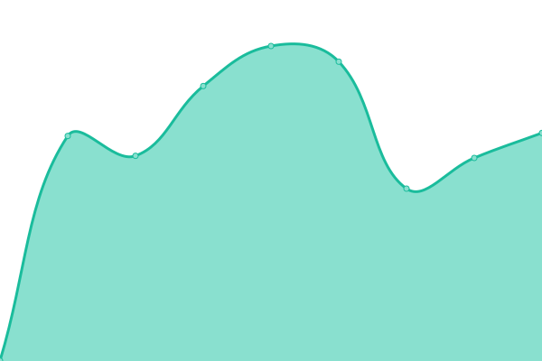

# [📈 Live Status](https:///status): <!--live status--> **🟧 Partial outage**

This repository contains the open-source uptime monitor and status page for [Upptime](https://upptime.js.org), powered by [Upptime](https://github.com/upptime/upptime).

With [Upptime](https://upptime.js.org), you can get your own unlimited and free uptime monitor and status page, powered entirely by a GitHub repository. We use [Issues](https://github.com/upptime/upptime/issues) as incident reports, [Actions](https://github.com/sbesson/status/actions) as uptime monitors, and [Pages](https:///status) for the status page.

<!--start: status pages-->
<!-- This summary is generated by Upptime (https://github.com/upptime/upptime) -->
<!-- Do not edit this manually, your changes will be overwritten -->
<!-- prettier-ignore -->
| URL | Status | History | Response Time | Uptime |
| --- | ------ | ------- | ------------- | ------ |
|  [OME website](https://www.openmicroscopy.org) | 🟩 Up | [ome-website.yml](https://github.com/ome/upptime/commits/HEAD/history/ome-website.yml) | 

 740ms
     
 | 

<a href="https://ome.github.io/upptime/history/ome-website">100.00%</a>
    

|  [OME website (alias)](https://openmicroscopy.org) | 🟩 Up | [ome-website-alias.yml](https://github.com/ome/upptime/commits/HEAD/history/ome-website-alias.yml) | 

 732ms
     
 | 

<a href="https://ome.github.io/upptime/history/ome-website-alias">100.00%</a>
    

|  [OME website (legacy)](https://www-legacy.openmicroscopy.org) | 🟩 Up | [ome-website-legacy.yml](https://github.com/ome/upptime/commits/HEAD/history/ome-website-legacy.yml) | 

 1066ms
     
 | 

<a href="https://ome.github.io/upptime/history/ome-website-legacy">100.00%</a>
    

|  [OME blog (redirected)](https://blog.openmicroscopy.org) | 🟩 Up | [ome-blog-redirected.yml](https://github.com/ome/upptime/commits/HEAD/history/ome-blog-redirected.yml) | 

 197ms
     
 | 

<a href="https://ome.github.io/upptime/history/ome-blog-redirected">100.00%</a>
    

|  [OME NGFF](https://ngff.openmicroscopy.org) | 🟩 Up | [ome-ngff.yml](https://github.com/ome/upptime/commits/HEAD/history/ome-ngff.yml) | 

 156ms
     
 | 

<a href="https://ome.github.io/upptime/history/ome-ngff">100.00%</a>
    

|  [OME forum (legacy)](https://phpbb.openmicroscopy.org) | 🟩 Up | [ome-forum-legacy.yml](https://github.com/ome/upptime/commits/HEAD/history/ome-forum-legacy.yml) | 

 883ms
     
 | 

<a href="https://ome.github.io/upptime/history/ome-forum-legacy">100.00%</a>
    

|  [OMERO figure static website (redirected)](https://figure.openmicroscopy.org) | 🟩 Up | [omero-figure-static-website-redirected.yml](https://github.com/ome/upptime/commits/HEAD/history/omero-figure-static-website-redirected.yml) | 

 135ms
     
 | 

<a href="https://ome.github.io/upptime/history/omero-figure-static-website-redirected">100.00%</a>
    

|  [OME help (redirected)](https://help.openmicroscopy.org) | 🟩 Up | [ome-help-redirected.yml](https://github.com/ome/upptime/commits/HEAD/history/ome-help-redirected.yml) | 

 181ms
     
 | 

<a href="https://ome.github.io/upptime/history/ome-help-redirected">100.00%</a>
    

|  [OME contributing](https://ome-contributing.readthedocs.io/en/latest/) | 🟩 Up | [ome-contributing.yml](https://github.com/ome/upptime/commits/HEAD/history/ome-contributing.yml) | 

 211ms
     
 | 

<a href="https://ome.github.io/upptime/history/ome-contributing">100.00%</a>
    

|  [OME contributing (redirected)](https://www.openmicroscopy.org/site/support/contributing/) | 🟩 Up | [ome-contributing-redirected.yml](https://github.com/ome/upptime/commits/HEAD/history/ome-contributing-redirected.yml) | 

 760ms
     
 | 

<a href="https://ome.github.io/upptime/history/ome-contributing-redirected">100.00%</a>
    

|  [OME artifactory](https://artifacts.openmicroscopy.org) | 🟩 Up | [ome-artifactory.yml](https://github.com/ome/upptime/commits/HEAD/history/ome-artifactory.yml) | 

 480ms
     
 | 

<a href="https://ome.github.io/upptime/history/ome-artifactory">100.00%</a>
    

|  [OME downloads](https://downloads.openmicroscopy.org) | 🟩 Up | [ome-downloads.yml](https://github.com/ome/upptime/commits/HEAD/history/ome-downloads.yml) | 

 442ms
     
 | 

<a href="https://ome.github.io/upptime/history/ome-downloads">100.00%</a>
    

|  [OME documentation](https://docs.openmicroscopy.org) | 🟩 Up | [ome-documentation.yml](https://github.com/ome/upptime/commits/HEAD/history/ome-documentation.yml) | 

 472ms
     
 | 

<a href="https://ome.github.io/upptime/history/ome-documentation">100.00%</a>
    

|  [OME demo server](https://demo.openmicroscopy.org) | 🟩 Up | [ome-demo-server.yml](https://github.com/ome/upptime/commits/HEAD/history/ome-demo-server.yml) | 

 759ms
     
 | 

<a href="https://ome.github.io/upptime/history/ome-demo-server">100.00%</a>
    

|  [OME XSD schemas](http://www.openmicroscopy.org/Schemas) | 🟩 Up | [ome-xsd-schemas.yml](https://github.com/ome/upptime/commits/HEAD/history/ome-xsd-schemas.yml) | 

 475ms
     
 | 

<a href="https://ome.github.io/upptime/history/ome-xsd-schemas">100.00%</a>
    

|  [OME CI server (legacy)](https://ci.openmicroscopy.org) | 🟩 Up | [ome-ci-server-legacy.yml](https://github.com/ome/upptime/commits/HEAD/history/ome-ci-server-legacy.yml) | 

 788ms
     
 | 

<a href="https://ome.github.io/upptime/history/ome-ci-server-legacy">100.00%</a>
    

|  [OME CI server (merge)](https://merge-ci.openmicroscopy.org/jenkins) | 🟩 Up | [ome-ci-server-merge.yml](https://github.com/ome/upptime/commits/HEAD/history/ome-ci-server-merge.yml) | 

 834ms
     
 | 

<a href="https://ome.github.io/upptime/history/ome-ci-server-merge">100.00%</a>
    

|  [OME CI server (latest)](https://latest-ci.openmicroscopy.org/jenkins) | 🟩 Up | [ome-ci-server-latest.yml](https://github.com/ome/upptime/commits/HEAD/history/ome-ci-server-latest.yml) | 

 825ms
     
 | 

<a href="https://ome.github.io/upptime/history/ome-ci-server-latest">100.00%</a>
    

|  [OME training server 1](https://outreach.openmicroscopy.org) | 🟩 Up | [ome-training-server-1.yml](https://github.com/ome/upptime/commits/HEAD/history/ome-training-server-1.yml) | 

 753ms
     
 | 

<a href="https://ome.github.io/upptime/history/ome-training-server-1">100.00%</a>
    

|  [OME issue tracking system (legacy)](https://trac.openmicroscopy.org) | 🟩 Up | [ome-issue-tracking-system-legacy.yml](https://github.com/ome/upptime/commits/HEAD/history/ome-issue-tracking-system-legacy.yml) | 

 853ms
     
 | 

<a href="https://ome.github.io/upptime/history/ome-issue-tracking-system-legacy">100.00%</a>
    

|  [OME file formats (redirected)](http://www.openmicroscopy.org/site/support/file-formats) | 🟩 Up | [ome-file-formats-redirected.yml](https://github.com/ome/upptime/commits/HEAD/history/ome-file-formats-redirected.yml) | 

 1250ms
     
 | 

<a href="https://ome.github.io/upptime/history/ome-file-formats-redirected">100.00%</a>
    

|  [OME units documentation (redirected)](https://www.openmicroscopy.org/site/support/ome-model/developers/ome-units.html) | 🟩 Up | [ome-units-documentation-redirected.yml](https://github.com/ome/upptime/commits/HEAD/history/ome-units-documentation-redirected.yml) | 

 1589ms
     
 | 

<a href="https://ome.github.io/upptime/history/ome-units-documentation-redirected">100.00%</a>
    

|  [OME training server 2](https://workshop.openmicroscopy.org) | 🟩 Up | [ome-training-server-2.yml](https://github.com/ome/upptime/commits/HEAD/history/ome-training-server-2.yml) | 

 726ms
     
 | 

<a href="https://ome.github.io/upptime/history/ome-training-server-2">100.00%</a>
    

|  [OME Q&A](http://qa.openmicroscopy.org.uk/) | 🟩 Up | [ome-q-and-a.yml](https://github.com/ome/upptime/commits/HEAD/history/ome-q-and-a.yml) | 

 479ms
     
 | 

<a href="https://ome.github.io/upptime/history/ome-q-and-a">100.00%</a>
    

|  [OME GitHub](https://github.com/ome) | 🟩 Up | [ome-git-hub.yml](https://github.com/ome/upptime/commits/HEAD/history/ome-git-hub.yml) | 

 514ms
     
 | 

<a href="https://ome.github.io/upptime/history/ome-git-hub">100.00%</a>
    

|  OME gate (22) | 🟩 Up | [ome-gate-22.yml](https://github.com/ome/upptime/commits/HEAD/history/ome-gate-22.yml) | 

 112ms
     
 | 

<a href="https://ome.github.io/upptime/history/ome-gate-22">100.00%</a>
    

|  OME gate (443) | 🟩 Up | [ome-gate-443.yml](https://github.com/ome/upptime/commits/HEAD/history/ome-gate-443.yml) | 

 100ms
     
 | 

<a href="https://ome.github.io/upptime/history/ome-gate-443">100.00%</a>
    

|  [UoD SLS OMERO (authenticated)](https://nightshade.openmicroscopy.org) | 🟩 Up | [uo-d-sls-omero-authenticated.yml](https://github.com/ome/upptime/commits/HEAD/history/uo-d-sls-omero-authenticated.yml) | 

 793ms
     
 | 

<a href="https://ome.github.io/upptime/history/uo-d-sls-omero-authenticated">100.00%</a>
    

|  [UoD SLS OMERO (4063)](nightshade.openmicroscopy.org) | 🟩 Up | [uo-d-sls-omero-4063.yml](https://github.com/ome/upptime/commits/HEAD/history/uo-d-sls-omero-4063.yml) | 

 109ms
     
 | 

<a href="https://ome.github.io/upptime/history/uo-d-sls-omero-4063">100.00%</a>
    

|  [UoD SLS OMERO (4064)](nightshade.openmicroscopy.org) | 🟩 Up | [uo-d-sls-omero-4064.yml](https://github.com/ome/upptime/commits/HEAD/history/uo-d-sls-omero-4064.yml) | 

 109ms
     
 | 

<a href="https://ome.github.io/upptime/history/uo-d-sls-omero-4064">100.00%</a>
    

|  [UoD SLS OMERO (public)](https://omero.lifesci.dundee.ac.uk) | 🟩 Up | [uo-d-sls-omero-public.yml](https://github.com/ome/upptime/commits/HEAD/history/uo-d-sls-omero-public.yml) | 

 2391ms
     
 | 

<a href="https://ome.github.io/upptime/history/uo-d-sls-omero-public">100.00%</a>
    

|  [UoD SLS OMERO (image 3925540 - render_thumbnail)](https://omero.lifesci.dundee.ac.uk/webgateway/render_thumbnail/3925540/) | 🟩 Up | [uo-d-sls-omero-image-3925540-render-thumbnail.yml](https://github.com/ome/upptime/commits/HEAD/history/uo-d-sls-omero-image-3925540-render-thumbnail.yml) | 

 311ms
     
 | 

<a href="https://ome.github.io/upptime/history/uo-d-sls-omero-image-3925540-render-thumbnail">100.00%</a>
    

|  [UoD SLS OMERO (image 3925540 - render_image)](https://omero.lifesci.dundee.ac.uk/webgateway/render_image/3925540/3/5/) | 🟩 Up | [uo-d-sls-omero-image-3925540-render-image.yml](https://github.com/ome/upptime/commits/HEAD/history/uo-d-sls-omero-image-3925540-render-image.yml) | 

 520ms
     
 | 

<a href="https://ome.github.io/upptime/history/uo-d-sls-omero-image-3925540-render-image">100.00%</a>
    

|  [UoD SLS OMERO (image 3925540 - img_detail)](https://omero.lifesci.dundee.ac.uk/webgateway/img_detail/3925540/) | 🟩 Up | [uo-d-sls-omero-image-3925540-img-detail.yml](https://github.com/ome/upptime/commits/HEAD/history/uo-d-sls-omero-image-3925540-img-detail.yml) | 

 438ms
     
 | 

<a href="https://ome.github.io/upptime/history/uo-d-sls-omero-image-3925540-img-detail">100.00%</a>
    

|  [UoD SLS OMERO (10.17867/10000109)](http://dx.doi.org/10.17867/10000109) | 🟩 Up | [uo-d-sls-omero-10-17867-10000109.yml](https://github.com/ome/upptime/commits/HEAD/history/uo-d-sls-omero-10-17867-10000109.yml) | 

 1832ms
     
 | 

<a href="https://ome.github.io/upptime/history/uo-d-sls-omero-10-17867-10000109">100.00%</a>
    

|  [UoD teaching OMERO](https://learning.openmicroscopy.org) | 🟩 Up | [uo-d-teaching-omero.yml](https://github.com/ome/upptime/commits/HEAD/history/uo-d-teaching-omero.yml) | 

 788ms
     
 | 

<a href="https://ome.github.io/upptime/history/uo-d-teaching-omero">100.00%</a>
    

|  [IDR](https://idr.openmicroscopy.org) | 🟩 Up | [idr.yml](https://github.com/ome/upptime/commits/HEAD/history/idr.yml) | 

 534ms
     
 | 

<a href="https://ome.github.io/upptime/history/idr">100.00%</a>
    

|  [IDR FTP](idr-ftp.openmicroscopy.org) | 🟩 Up | [idr-ftp.yml](https://github.com/ome/upptime/commits/HEAD/history/idr-ftp.yml) | 

 105ms
     
 | 

<a href="https://ome.github.io/upptime/history/idr-ftp">100.00%</a>
    

|  [ITR](https://itr.openmicroscopy.org) | 🟩 Up | [itr.yml](https://github.com/ome/upptime/commits/HEAD/history/itr.yml) | 

 678ms
     
 | 

<a href="https://ome.github.io/upptime/history/itr">100.00%</a>
    

|  [IDR API](https://idr.openmicroscopy.org/about/api.html) | 🟩 Up | [idr-api.yml](https://github.com/ome/upptime/commits/HEAD/history/idr-api.yml) | 

 182ms
     
 | 

<a href="https://ome.github.io/upptime/history/idr-api">100.00%</a>
    

|  [IDR submission](https://idr.openmicroscopy.org/about/submission.html) | 🟩 Up | [idr-submission.yml](https://github.com/ome/upptime/commits/HEAD/history/idr-submission.yml) | 

 182ms
     
 | 

<a href="https://ome.github.io/upptime/history/idr-submission">100.00%</a>
    

|  [IDR Analysis](https://idr-analysis.openmicroscopy.org) | 🟩 Up | [idr-analysis.yml](https://github.com/ome/upptime/commits/HEAD/history/idr-analysis.yml) | 

 579ms
     
 | 

<a href="https://ome.github.io/upptime/history/idr-analysis">100.00%</a>
    

|  [IDR Jupyter](https://idr.openmicroscopy.org/jupyter) | 🟩 Up | [idr-jupyter.yml](https://github.com/ome/upptime/commits/HEAD/history/idr-jupyter.yml) | 

 182ms
     
 | 

<a href="https://ome.github.io/upptime/history/idr-jupyter">100.00%</a>
    

|  [IDR (well 590686)](https://idr.openmicroscopy.org/webclient/?show=well-590686) | 🟩 Up | [idr-well-590686.yml](https://github.com/ome/upptime/commits/HEAD/history/idr-well-590686.yml) | 

 523ms
     
 | 

<a href="https://ome.github.io/upptime/history/idr-well-590686">100.00%</a>
    

|  [IDR (well 119093)](https://idr.openmicroscopy.org/webclient/?show=well-119093) | 🟩 Up | [idr-well-119093.yml](https://github.com/ome/upptime/commits/HEAD/history/idr-well-119093.yml) | 

 356ms
     
 | 

<a href="https://ome.github.io/upptime/history/idr-well-119093">100.00%</a>
    

|  [IDR (well 4852)](https://idr.openmicroscopy.org/webclient/?show=well-4852) | 🟩 Up | [idr-well-4852.yml](https://github.com/ome/upptime/commits/HEAD/history/idr-well-4852.yml) | 

 351ms
     
 | 

<a href="https://ome.github.io/upptime/history/idr-well-4852">100.00%</a>
    

|  [IDR (well 469267)](https://idr.openmicroscopy.org/webclient/?show=well-469267) | 🟩 Up | [idr-well-469267.yml](https://github.com/ome/upptime/commits/HEAD/history/idr-well-469267.yml) | 

 344ms
     
 | 

<a href="https://ome.github.io/upptime/history/idr-well-469267">100.00%</a>
    

|  [IDR (well 547609)](https://idr.openmicroscopy.org/webclient/?show=well-547609) | 🟩 Up | [idr-well-547609.yml](https://github.com/ome/upptime/commits/HEAD/history/idr-well-547609.yml) | 

 345ms
     
 | 

<a href="https://ome.github.io/upptime/history/idr-well-547609">100.00%</a>
    

|  [IDR (image 820684)](https://idr.openmicroscopy.org/webclient/?show=image-820684) | 🟩 Up | [idr-image-820684.yml](https://github.com/ome/upptime/commits/HEAD/history/idr-image-820684.yml) | 

 415ms
     
 | 

<a href="https://ome.github.io/upptime/history/idr-image-820684">100.00%</a>
    

|  [IDR (well 37472)](https://idr.openmicroscopy.org/webclient/?show=well-37472) | 🟩 Up | [idr-well-37472.yml](https://github.com/ome/upptime/commits/HEAD/history/idr-well-37472.yml) | 

 351ms
     
 | 

<a href="https://ome.github.io/upptime/history/idr-well-37472">100.00%</a>
    

|  [IDR (well 45407)](https://idr.openmicroscopy.org/webclient/?show=well-45407) | 🟩 Up | [idr-well-45407.yml](https://github.com/ome/upptime/commits/HEAD/history/idr-well-45407.yml) | 

 334ms
     
 | 

<a href="https://ome.github.io/upptime/history/idr-well-45407">100.00%</a>
    

|  [IDR (image 648950)](https://idr.openmicroscopy.org/webclient/?show=image-648950) | 🟩 Up | [idr-image-648950.yml](https://github.com/ome/upptime/commits/HEAD/history/idr-image-648950.yml) | 

 394ms
     
 | 

<a href="https://ome.github.io/upptime/history/idr-image-648950">100.00%</a>
    

|  [IDR (image 3063667)](https://idr.openmicroscopy.org/webclient/?show=image-3063667) | 🟩 Up | [idr-image-3063667.yml](https://github.com/ome/upptime/commits/HEAD/history/idr-image-3063667.yml) | 

 402ms
     
 | 

<a href="https://ome.github.io/upptime/history/idr-image-3063667">100.00%</a>
    

|  [IDR (image 2849866)](https://idr.openmicroscopy.org/webclient/?show=image-2849866) | 🟩 Up | [idr-image-2849866.yml](https://github.com/ome/upptime/commits/HEAD/history/idr-image-2849866.yml) | 

 365ms
     
 | 

<a href="https://ome.github.io/upptime/history/idr-image-2849866">100.00%</a>
    

|  [IDR (image 1821818)](https://idr.openmicroscopy.org/webclient/?show=image-1821818) | 🟩 Up | [idr-image-1821818.yml](https://github.com/ome/upptime/commits/HEAD/history/idr-image-1821818.yml) | 

 379ms
     
 | 

<a href="https://ome.github.io/upptime/history/idr-image-1821818">100.00%</a>
    

|  [IDR (image 1636543)](https://idr.openmicroscopy.org/webclient/?show=image-1636543) | 🟩 Up | [idr-image-1636543.yml](https://github.com/ome/upptime/commits/HEAD/history/idr-image-1636543.yml) | 

 384ms
     
 | 

<a href="https://ome.github.io/upptime/history/idr-image-1636543">100.00%</a>
    

|  [IDR (well 1056578)](https://idr.openmicroscopy.org/webclient/?show=well-1056578) | 🟩 Up | [idr-well-1056578.yml](https://github.com/ome/upptime/commits/HEAD/history/idr-well-1056578.yml) | 

 358ms
     
 | 

<a href="https://ome.github.io/upptime/history/idr-well-1056578">100.00%</a>
    

|  [IDR (well 1029401)](https://idr.openmicroscopy.org/webclient/?show=well-1029401) | 🟩 Up | [idr-well-1029401.yml](https://github.com/ome/upptime/commits/HEAD/history/idr-well-1029401.yml) | 

 345ms
     
 | 

<a href="https://ome.github.io/upptime/history/idr-well-1029401">100.00%</a>
    

|  [IDR (well 1046336)](https://idr.openmicroscopy.org/webclient/?show=well-1046336) | 🟩 Up | [idr-well-1046336.yml](https://github.com/ome/upptime/commits/HEAD/history/idr-well-1046336.yml) | 

 348ms
     
 | 

<a href="https://ome.github.io/upptime/history/idr-well-1046336">100.00%</a>
    

|  [IDR (dataset 369)](https://idr.openmicroscopy.org/webclient/?show=dataset-369) | 🟩 Up | [idr-dataset-369.yml](https://github.com/ome/upptime/commits/HEAD/history/idr-dataset-369.yml) | 

 325ms
     
 | 

<a href="https://ome.github.io/upptime/history/idr-dataset-369">100.00%</a>
    

|  [IDR (well 1024671)](https://idr.openmicroscopy.org/webclient/?show=well-1024671) | 🟩 Up | [idr-well-1024671.yml](https://github.com/ome/upptime/commits/HEAD/history/idr-well-1024671.yml) | 

 346ms
     
 | 

<a href="https://ome.github.io/upptime/history/idr-well-1024671">100.00%</a>
    

|  [IDR (well 1030579)](https://idr.openmicroscopy.org/webclient/?show=well-1030579) | 🟩 Up | [idr-well-1030579.yml](https://github.com/ome/upptime/commits/HEAD/history/idr-well-1030579.yml) | 

 357ms
     
 | 

<a href="https://ome.github.io/upptime/history/idr-well-1030579">100.00%</a>
    

|  [IDR (dataset 51)](https://idr.openmicroscopy.org/webclient/?show=dataset-51) | 🟩 Up | [idr-dataset-51.yml](https://github.com/ome/upptime/commits/HEAD/history/idr-dataset-51.yml) | 

 309ms
     
 | 

<a href="https://ome.github.io/upptime/history/idr-dataset-51">100.00%</a>
    

|  [IDR (dataset 61)](https://idr.openmicroscopy.org/webclient/?show=dataset-61) | 🟩 Up | [idr-dataset-61.yml](https://github.com/ome/upptime/commits/HEAD/history/idr-dataset-61.yml) | 

 330ms
     
 | 

<a href="https://ome.github.io/upptime/history/idr-dataset-61">100.00%</a>
    

|  [IDR 2858266](https://idr.openmicroscopy.org/webclient/?show=image-2858266) | 🟩 Up | [idr-2858266.yml](https://github.com/ome/upptime/commits/HEAD/history/idr-2858266.yml) | 

 339ms
     
 | 

<a href="https://ome.github.io/upptime/history/idr-2858266">100.00%</a>
    

|  [IDR (image 2895051)](https://idr.openmicroscopy.org/webclient/?show=image-2895051) | 🟩 Up | [idr-image-2895051.yml](https://github.com/ome/upptime/commits/HEAD/history/idr-image-2895051.yml) | 

 398ms
     
 | 

<a href="https://ome.github.io/upptime/history/idr-image-2895051">100.00%</a>
    

|  [IDR (image 3125776)](https://idr.openmicroscopy.org/webclient/?show=image-3125776) | 🟩 Up | [idr-image-3125776.yml](https://github.com/ome/upptime/commits/HEAD/history/idr-image-3125776.yml) | 

 355ms
     
 | 

<a href="https://ome.github.io/upptime/history/idr-image-3125776">100.00%</a>
    

|  [IDR (phenotype CMPO_0000393)](https://idr.openmicroscopy.org/mapr/phenotype/?value=CMPO_0000393) | 🟩 Up | [idr-phenotype-cmpo-0000393.yml](https://github.com/ome/upptime/commits/HEAD/history/idr-phenotype-cmpo-0000393.yml) | 

 190ms
     
 | 

<a href="https://ome.github.io/upptime/history/idr-phenotype-cmpo-0000393">100.00%</a>
    

|  [IDR (phenotype CMPO_0000118)](https://idr.openmicroscopy.org/mapr/phenotype/?value=CMPO_0000118) | 🟩 Up | [idr-phenotype-cmpo-0000118.yml](https://github.com/ome/upptime/commits/HEAD/history/idr-phenotype-cmpo-0000118.yml) | 

 189ms
     
 | 

<a href="https://ome.github.io/upptime/history/idr-phenotype-cmpo-0000118">100.00%</a>
    

|  [IDR (phenotype CMPO_0000140)](https://idr.openmicroscopy.org/mapr/phenotype/?value=CMPO_0000140) | 🟩 Up | [idr-phenotype-cmpo-0000140.yml](https://github.com/ome/upptime/commits/HEAD/history/idr-phenotype-cmpo-0000140.yml) | 

 189ms
     
 | 

<a href="https://ome.github.io/upptime/history/idr-phenotype-cmpo-0000140">100.00%</a>
    

|  [IDR (gene SGOL1)](https://idr.openmicroscopy.org/mapr/gene/?value=SGOL1) | 🟩 Up | [idr-gene-sgol-1.yml](https://github.com/ome/upptime/commits/HEAD/history/idr-gene-sgol-1.yml) | 

 189ms
     
 | 

<a href="https://ome.github.io/upptime/history/idr-gene-sgol-1">100.00%</a>
    

|  [IDR (gene Car4)](https://idr.openmicroscopy.org/mapr/gene/?value=Car4) | 🟩 Up | [idr-gene-car4.yml](https://github.com/ome/upptime/commits/HEAD/history/idr-gene-car4.yml) | 

 225ms
     
 | 

<a href="https://ome.github.io/upptime/history/idr-gene-car4">100.00%</a>
    

|  [IDR (dataset 153)](https://idr.openmicroscopy.org/webclient/?show=dataset-153) | 🟩 Up | [idr-dataset-153.yml](https://github.com/ome/upptime/commits/HEAD/history/idr-dataset-153.yml) | 

 307ms
     
 | 

<a href="https://ome.github.io/upptime/history/idr-dataset-153">100.00%</a>
    

|  [IDR (image 1918940)](https://idr.openmicroscopy.org/webclient/?show=image-1918940) | 🟩 Up | [idr-image-1918940.yml](https://github.com/ome/upptime/commits/HEAD/history/idr-image-1918940.yml) | 

 321ms
     
 | 

<a href="https://ome.github.io/upptime/history/idr-image-1918940">100.00%</a>
    

|  [IDR (image 1918953)](https://idr.openmicroscopy.org/webclient/?show=image-1918953) | 🟩 Up | [idr-image-1918953.yml](https://github.com/ome/upptime/commits/HEAD/history/idr-image-1918953.yml) | 

 320ms
     
 | 

<a href="https://ome.github.io/upptime/history/idr-image-1918953">100.00%</a>
    

|  [IDR (well 828419)](https://idr.openmicroscopy.org/webclient/?show=well-828419) | 🟩 Up | [idr-well-828419.yml](https://github.com/ome/upptime/commits/HEAD/history/idr-well-828419.yml) | 

 342ms
     
 | 

<a href="https://ome.github.io/upptime/history/idr-well-828419">100.00%</a>
    

|  [IDR (mineotaur)](https://idr.openmicroscopy.org/mineotaur/) | 🟩 Up | [idr-mineotaur.yml](https://github.com/ome/upptime/commits/HEAD/history/idr-mineotaur.yml) | 

 189ms
     
 | 

<a href="https://ome.github.io/upptime/history/idr-mineotaur">100.00%</a>
    

|  [IDR (well 592371)](https://idr.openmicroscopy.org/webclient/?show=well-592371) | 🟩 Up | [idr-well-592371.yml](https://github.com/ome/upptime/commits/HEAD/history/idr-well-592371.yml) | 

 349ms
     
 | 

<a href="https://ome.github.io/upptime/history/idr-well-592371">100.00%</a>
    

|  [IDR notebooks (GitHub)](https://github.com/IDR/idr-notebooks) | 🟩 Up | [idr-notebooks-git-hub.yml](https://github.com/ome/upptime/commits/HEAD/history/idr-notebooks-git-hub.yml) | 

 493ms
     
 | 

<a href="https://ome.github.io/upptime/history/idr-notebooks-git-hub">100.00%</a>
    

|  [IDR metadata (GitHub)](https://github.com/IDR/idr-metadata) | 🟩 Up | [idr-metadata-git-hub.yml](https://github.com/ome/upptime/commits/HEAD/history/idr-metadata-git-hub.yml) | 

 428ms
     
 | 

<a href="https://ome.github.io/upptime/history/idr-metadata-git-hub">100.00%</a>
    

|  IDR tracking system | 🟥 Down | [idr-tracking-system.yml](https://github.com/ome/upptime/commits/HEAD/history/idr-tracking-system.yml) | 

 1071ms
     
 | 

<a href="https://ome.github.io/upptime/history/idr-tracking-system">99.93%</a>
    

<!--end: status pages-->

[**Visit our status website →**](https:///status)

## 📄 License

- Powered by: [Upptime](https://github.com/upptime/upptime)
- Code: [MIT](./LICENSE) © [Upptime](https://upptime.js.org)
- Data in the `./history` directory: [Open Database License](https://opendatacommons.org/licenses/odbl/1-0/)
